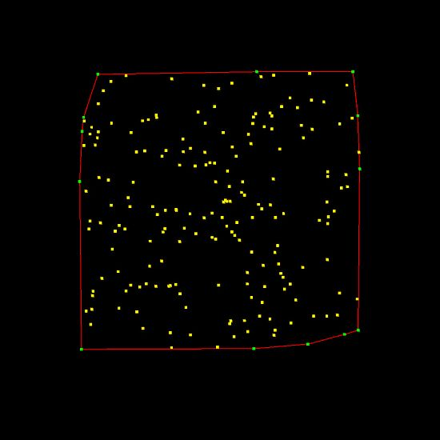
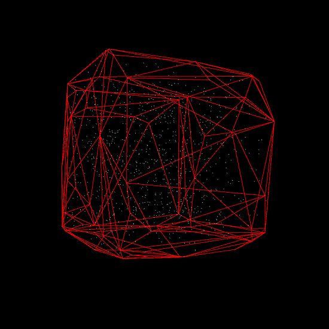
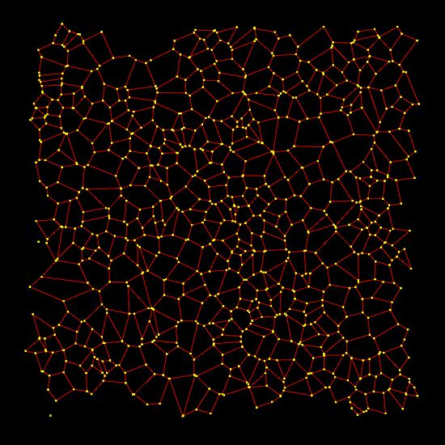

# Hull-Delaunay-Voronoi

This project shows how to calculate the Convex Hull, Delaunay triangulation or Voronoi diagram from a random set of points. The project is based of the [MIConvex Hull](https://designengrlab.github.io/MIConvexHull/) code but I have restructured it a bit and extended the Delaunay and Voronoi parts.

The 3 concepts of Hull, Delaunay and Voronoi or all related. If you have a Convex Hull algorithm that will work for any dimension of space then you can use that to find the Delaunay triangulation using the 'lifting method'. From the Delaunay triangulation you can then find the Voronoi diagram as its the Delaunay's Dual Graph.

The code to calculate the convex hull may throw a exception. For example if a 2D hull tries to process a line that has two vertices in the same position or a 3D hull tries to process a triangle where all the points are co-planar (they form a line). These can not be processed so will result in a error. Randomizing the vertices order or adding a small amount of noise to the positions can solve this.

A Convex Hull from 2D points.

A Convex Hull from 3D points.

A Delaunay triangulation from 2D points.

![2D Delaunay triangulation](./Media/HullDelaunayVoronoi3.jpg

A Voronoi diagram from 2D points.

A Voronoi diagram from 3D points.

![3D Voronoi diagram](./Media/HullDelaunayVoronoi5.jpg
